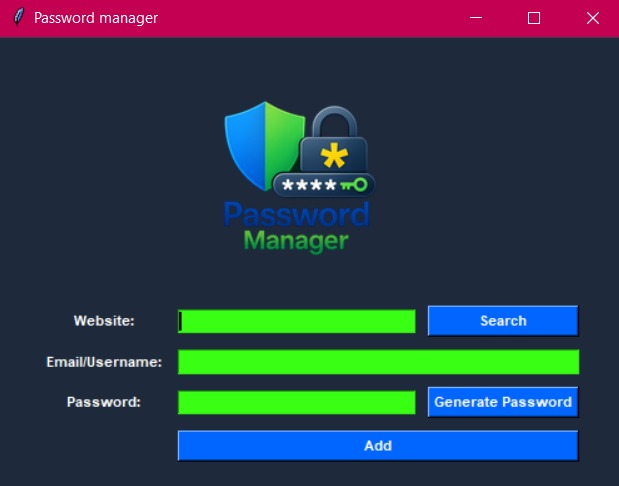
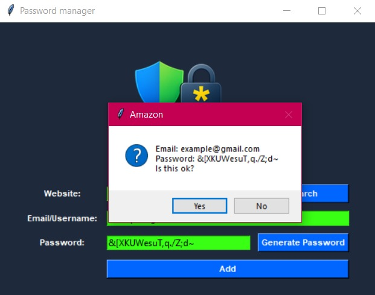
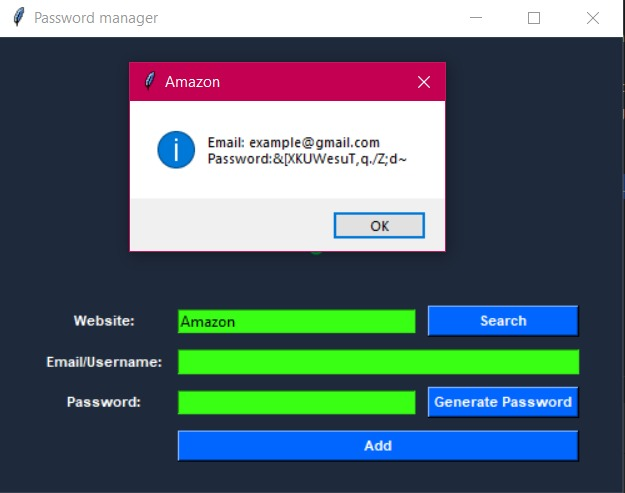

<p align="center">
  
</p>

# Password Manager

A modern password manager built with Python and Tkinter.

## Features

- Generate secure passwords
- Save credentials
- Copy passwords to clipboard
- Simple and modern GUI

## Technologies Used

- Python
- Tkinter
- JSON

## Screenshots

### Main Window



### Password Generator



### Saved Credentials



## Run Project

```bash
python main.py
```